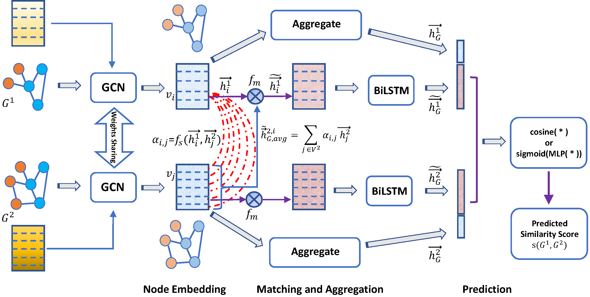

# Multi-Level Graph Matching Networks for Deep Graph Similarity Learning


## 1. Description

In this paper, we propose a Multi-Level Graph Matching Network (MGMN) framework for computing the graph similarity between any pair of graph-structured objects in an end-to-end fashion. 
MGMN consists of a node-graph matching network for effectively learning cross-level interactions between each node of one graph and the other
whole graph, and a siamese graph neural network to learn global-level interactions between two input graphs.


### 1.1 citation:
Xiang Ling, Lingfei Wu, Saizhuo Wang, Tengfei Ma, Fangli Xu, Chunming Wu and Shouling Ji, **Multi-level Graph Matching Networks for Deep Graph Similarity Learning**, IEEE Transactions on Neural Networks and Learning Systems (**TNNLS**), 2021
 ``` 
  @article{ling2021multilevel,
    title={Multi-Level Graph Matching Networks for Deep Graph Similarity Learning},
    author={Ling, Xiang and Wu, Lingfei and Wang, Saizhuo and Ma, Tengfei and Xu, Fangli and Liu, Alex X and Wu, Chunming and Ji, Shouling},
    journal={IEEE Transactions on Neural Networks and Learning Systems (TNNLS)},
    publisher={IEEE},
    volume={},
    number={},
    pages={--},
    url={},
    year={2021}
  }
 ```

### 1.2 glance:

```
├─── src
│    ├─── model
│    │    ├─── __init__.py
│    │    ├─── DenseGGNN.py
│    │    ├─── DenseGraphMatching.py
│    ├─── __init__.py
│    ├─── cfg_config.py
│    ├─── cfg_train.py
│    ├─── data.py
│    ├─── ged_config.py
│    ├─── ged_train.py
│    ├─── simgnn_utils.py
│    ├─── utils.py
├─── data
│    ├─── CFG
│    │    ├─── ...
│    ├─── GED
│    │    ├─── ...
├─── ...
```

## 2. How to run the codes


#### 2.1 The Graph-Graph Classification Task

(1) Prepare the dataset for the classification task.
> Datasets for the graph-graph classification task is provided in `data/CFG` directory.

(2) Specify some hyper-parameters for classification tasks in `src/cfg_config.py`

(3) Train and test the model by running the following command:

```
cd src
python cfg_train.py
```

#### 2.2 The Graph-Graph Regression Task
(1) Prepare the dataset for regression tasks

> Data for the graph-graph regression task are placed in `/data/GED` directory. 
> All the files required by our codes can be downloaded following instructions in this [repo](https://github.com/yunshengb/SimGNN).
Please make sure you have downloaded all the 3 directories required by our code: `data`, `save`, and `result`.

> After downloading these files, please put them under `/data/GED`, which is the default data folder by our configuration, or you can also specify your own data directory.

An example directory structure is:
``` 
data
├─── GED
│   ├── data
│   │    ├── AIDS700nef/
│   │    ├── LINUX/
│   ├── result
│   │    ├── aids700nef/
│   │    ├── linux/
│   ├── save
│   │    ├── dist_mat/
│   │    ├── aids700nef_ged_astar_gidpair_dist_map.pickle
│   │    ├── linux_ged_astar_gidpair_dist_map.pickle
```
(2) Specify some hyper-parameters for regression tasks in `src/ged_config.py`

(3) Train and test the model by running the following command:

```
cd src
python ged_train.py
```
